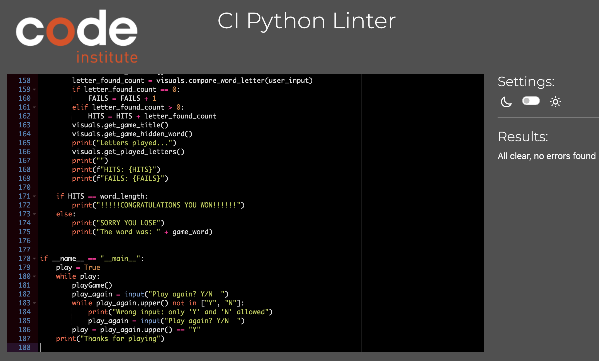

# PORTFOLIO PROJECT - 3

# HANGMAN

## PURPOSE

Hangman is a guessing game in which players try to guess a word or phrase by suggesting letters within a certain number of guesses. The game is typically represented by a blanked out word or phrase, with each letter that has been correctly guessed being filled in. If the player makes too many incorrect guesses, a "hangman" drawing, typically a stick figure being hanged, will be partially drawn, eventually leading to a full drawing and loss if all the incorrect guesses used up. It is a popular game often used to teach children spelling and vocabulary.

## FINAL RESULT

https://pp3hangman.herokuapp.com/

## THE MAIN IDEA

My initial idea for the project was to create a game that we all know as is been around for a long time and is very fun to play, simple and easy using all the information learned throughout the material of Python. 

### The Features I wanted the project to have are:

To make the game easy to play. Have an easy understanding how to play and to keep it as simple as possible.

## AS A USER 

* I want the game to have higher difficulty.
* I want to easily understand the main purpose of the game.
* I want random choices of words (10000).
* I want to be able to see how many attemps I have left.
* I want the option to play again.

## FEATURES

### The Features I want the game to have are:

* Allow the User to guess a word typing a letter of each underscore displayed on screen.
* To give an aspect of difficulty with 7 attempts.
* If either game is lost or finished, the User will be presented with a restart game option.
* To provide a game where the User guesses a ramdon word among 10000!.
* Make sure any User input is validated to prevent improper value input.
* Numbers and symbols would be consider as failed attemp.

### Game Goals:

To put in practise that I understand the basic skills to used Python. To give users an easy way to understand and easy way to play the game. To give users a good experience to come back and play the game.

## TESTING

The game has been tested in the terminal with the "pip install black" command. Write different input manually to see if the program responeded well, passed when put different characters in the termial including comas, numbers, blank spaces, etc.

## THIS IS HOW THE GAME LOOKS LIKE

* The first screen shows a welcoming message and the game is ready to play
image 1

* In here you can see when the user typed a wrong letter
image 2

* In here shows the right letter that the user typed on the hidden word lines
image 3

* In here you see the message the user sees when a character that's not a letter is been typed
image 4

* In here the game shows this message when notthing has been typed
image 5

* In here you see this message when the user runs out of options
image 6

## VALIDATORS

The game has been validated in the CI Python Linter.

## SOLVED BUGS AND ERRORS

* Corrected variables from camelCase to lowerCase with low_dash
* Mainly space and indentation errors

## UNSOLVED BUGS AND ERRORS

* I encounter 3 warning errors in run.py
* I encounter 6 blue (i) in run.py

## FUNCTIONALITY

The game has been tested, played and has responded correctly.

## TECHNOLOGIES USED

* This project was made using only Python.
* Code is written in Gitpod.
* This project has been deployed to HEROKU.

## USING THE HEROKU APP FOR DEPLOYMENT

* I started with creating a Config Var called PORT and set this to 8000 in my Heroku page.

### I Created The App Using Following Steps:

* I added two buildpacks from the settings tab. 

### The Ordering Is As Follows:

* heroku/python
* heroku/nodejs

## PROGRAMS USED

* GIT for version control.
* Commiting and pushing to Github. 
* Github used to store repositories.
* Files and images pushed from Gitpod.

## CREDITS AND CONTENT

* Shaun Halverson Software Developer & Youtuber. [Shaun in Action](https://youtu.be/pFvSb7cb_Us) - Shaun's youtube channel and some ideas taken from here.
* Antonio Rodriguez, my mentor.
* W3Schools.  
* Stackoverflow.
* Student care. 
* Slack community.

## ACKNOWLEDGMENTS

* This game was created for my PP3 Project for the Full Stack Software Developer program with Code Institute.

## David Angel, 2022/2023